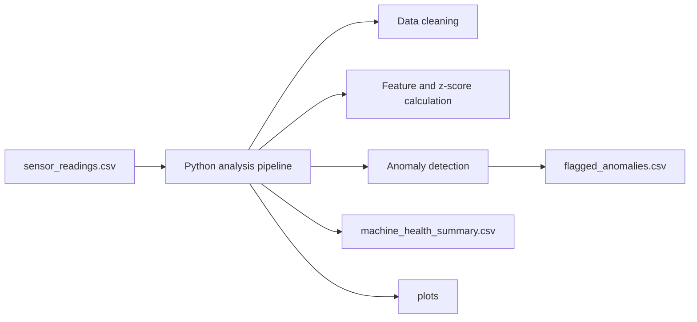

# Predictive Maintenance Anomaly Detection

This project is a public portfolio reconstruction of predictive maintenance work based on the kind of data analysis I described in my resume. It shows how machine sensor data can be processed, analyzed, and monitored to identify unusual operating behavior before failure happens.

## Why this project fits my profile

My background includes Python-based data processing, analytics, and technical data analysis. This repository highlights a different side of my portfolio from BI and ETL work by focusing on:

- time-series sensor data
- anomaly detection
- maintenance-oriented analysis
- technical reporting with Python

## Project timeline

Portfolio reconstruction of predictive maintenance analysis work from 2024.

## Business scenario

An industrial site collects machine sensor data such as temperature, vibration, pressure, and rotation speed. The goal is to detect abnormal behavior early so maintenance teams can investigate before a breakdown causes downtime.

This project simulates that workflow by:

- reading machine sensor records
- cleaning and validating the data
- calculating anomaly scores
- flagging high-risk observations
- summarizing machine health indicators

## Architecture



## Project structure

```text
predictive-maintenance-anomaly-detection/
|-- data/
|   `-- sample/
|       `-- sensor_readings.csv
|-- output/
|   |-- flagged_anomalies.csv
|   |-- machine_health_summary.csv
|   `-- machine_m01_signals.png
|-- src/
|   `-- analyze.py
|-- .gitignore
|-- README.md
`-- requirements.txt
```

## How to run

From this folder:

```powershell
python -m venv .venv
.venv\Scripts\Activate.ps1
pip install -r requirements.txt
python src\analyze.py
```

## Output

The script will:

- read sample IoT-style sensor data
- calculate z-scores for key metrics
- build a simple anomaly score
- flag abnormal records
- save anomaly and health summary files
- create a chart for one machine

## Skills demonstrated

- Python data analysis
- Pandas-based preprocessing
- time-series analysis
- anomaly detection for maintenance use cases
- technical project documentation

## Next improvements

- add rolling-window features
- compare simple statistical detection with machine learning methods
- build a dashboard for maintenance teams
- add maintenance event labels for supervised modeling

